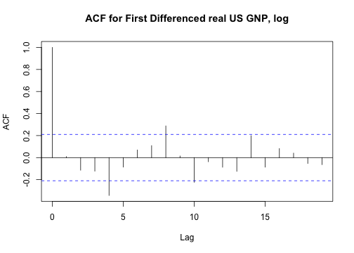

# fredr

[](https://travis-ci.org/sboysel/fredr)
[](https://ci.appveyor.com/project/sboysel/fredr)
[](https://codecov.io/github/sboysel/fredr)
[](https://github.com/sboysel/fredr/releases)
[](https://opensource.org/licenses/MIT)

`fredr` seamlessly interacts with the RESTful API for [Federal Reserve Economic
Data (FRED)](https://research.stlouisfed.org/fred2/), provided by the Federal
Reserve Bank of St. Louis.  Essentially a simple wrapper of
[`httr`](https://github.com/hadley/httr),
[`dplyr`](https://github.com/hadley/dplyr), and the FRED API itself, `fredr` is
designed with simplicity and flexibility in mind.  In addition a generic query
function `fredr` to return any query as a `data.frame`, the package also provides
convenience functions `fredr_search` and `fredr_series` to simplify the process
to finding and importing FRED data series as `R` objects.  As nearly all optional
parameters supplied to these functions are relayed verbatim to the API, the 
user is strongly encouraged to read the full [FRED
API](https://research.stlouisfed.org/docs/api/fred/) documentation to leverage the full power
of the FRED API and `fredr`. The convenience function `fredr_docs` quickly brings
up the web documentation. See the [section below](#usage) for usage
examples.

## Installation


```r
# install.packages("devtools")
devtools::install_github("sboysel/fredr")
```

## Usage

### Settining the FRED API key

Load `fredr` and set FRED API key in working directory.  You must first [obtain a FRED API
key](https://research.stlouisfed.org/docs/api/api_key.html).  It is also
recommended to reveiw the [FRED API Terms of
Use](https://research.stlouisfed.org/docs/api/terms_of_use.html).

```r
library(fredr)
fredr_key("abcdefghijklmnopqrstuvwxyz123456")
```

### Search for FRED data objects

Search for FRED series

```r
fredr_search(search_text = "unemployment")
#> Error: !is.null(search) is not TRUE
```

## Retrieve a FRED series

Get a FRED series.  Returns an `xts` object.

```r
library(dplyr)
library(xts)
fredr_series(series_id = "UNRATE",
             observation_start = "1990-01-01") %>%
    window(., start = "1990-01-01", end = "1991-01-01")
#>            UNRATE
#> 1990-01-01    5.4
#> 1990-02-01    5.3
#> 1990-03-01    5.2
#> 1990-04-01    5.4
#> 1990-05-01    5.4
#> 1990-06-01    5.2
#> 1990-07-01    5.5
#> 1990-08-01    5.7
#> 1990-09-01    5.9
#> 1990-10-01    5.9
#> 1990-11-01    6.2
#> 1990-12-01    6.3
#> 1991-01-01    6.4
```

Leverage the native features of the FRED API:

```r
fredr_series(series_id = "UNRATE",
             observation_start = "1990-01-01",
             frequency = "q",
             units = "chg") %>%
    window(., start = "1990-01-01", end = "1991-01-01")
#>            UNRATE
#> 1990-01-01   -0.1
#> 1990-04-01    0.0
#> 1990-07-01    0.4
#> 1990-10-01    0.4
#> 1991-01-01    0.5
```


```r
fredr_series(series_id = "GNPCA",
             units = "log") %>%
  diff() %>%
  na.omit() %>%
  StructTS() %>%
  residuals() %>%
  acf(., main = "ACF for First Differenced real US GNP, log")
```




```r
fredr_search(search_text = "federal funds",
             order_by = "popularity",
             limit = 1)$id %>%
  fredr_series(series_id = .) %>%
  plot(., main = "Federal Funds Rate")
#> Error: !is.null(search) is not TRUE
```

### Access API documentation

Quickly access the FRED API web documentation for any endpoint

```r
fredr_docs(endpoint = "series/observations")
```

You may also use the `params` option for `fredr_docs` to go straight to the
endpoint's Parameters section.

```r
fredr_docs(endpoint = "category/related_tags", params = TRUE)
```

A list of possible endpoints is contained in the data frame `fredr_endpoints`

```r
fredr_endpoints
#> # A tibble: 31 x 3
#>    endpoint                   type       note                             
#>    <chr>                      <chr>      <chr>                            
#>  1 fred/category              Categories Get a category                   
#>  2 fred/category/children     Categories Get the child categories for a s…
#>  3 fred/category/related      Categories Get the related categories for a…
#>  4 fred/category/series       Categories Get the series in a category     
#>  5 fred/category/tags         Categories Get the tags for a category      
#>  6 fred/category/related_tags Categories Get the related tags for a categ…
#>  7 fred/releases              Releases   Get all releases of economic data
#>  8 fred/releases/dates        Releases   Get release dates for all releas…
#>  9 fred/release               Releases   Get a release of economic data   
#> 10 fred/release/dates         Releases   Get release dates for a release …
#> # ... with 21 more rows
```

### General queries

You can also use the backbone function `fredr` to run more general queries
against *any* [FRED API
endpoint](https://research.stlouisfed.org/docs/api/fred/) (e.g. Categories,
Series, Sources, Releases, Tags).  This is also useful to return any arbitrary
information as a `data.frame`.

```r
fredr(endpoint = "tags/series", tag_names = "population;south africa")
#> # A tibble: 59 x 16
#>    id       realtime_start realtime_end title             observation_sta…
#>    <chr>    <chr>          <chr>        <chr>             <chr>           
#>  1 LFWA24T… 2018-02-27     2018-02-27   Working Age Popu… 2008-01-01      
#>  2 LFWA24T… 2018-02-27     2018-02-27   Working Age Popu… 2008-01-01      
#>  3 LFWA24T… 2018-02-27     2018-02-27   Working Age Popu… 2008-01-01      
#>  4 LFWA24T… 2018-02-27     2018-02-27   Working Age Popu… 2008-01-01      
#>  5 LFWA25T… 2018-02-27     2018-02-27   Working Age Popu… 2008-01-01      
#>  6 LFWA25T… 2018-02-27     2018-02-27   Working Age Popu… 2008-01-01      
#>  7 LFWA25T… 2018-02-27     2018-02-27   Working Age Popu… 2008-01-01      
#>  8 LFWA25T… 2018-02-27     2018-02-27   Working Age Popu… 2008-01-01      
#>  9 LFWA55T… 2018-02-27     2018-02-27   Working Age Popu… 2008-01-01      
#> 10 LFWA55T… 2018-02-27     2018-02-27   Working Age Popu… 2008-01-01      
#> # ... with 49 more rows, and 11 more variables: observation_end <chr>,
#> #   frequency <chr>, frequency_short <chr>, units <chr>,
#> #   units_short <chr>, seasonal_adjustment <chr>,
#> #   seasonal_adjustment_short <chr>, last_updated <chr>, popularity <int>,
#> #   group_popularity <int>, notes <chr>
```

Set `to_frame` to `FALSE` to return a generic `response` object from a `httr::GET` request that can be further parsed with `httr::content`

```r
library(httr)
resp <- fredr::fredr(endpoint = "series/observations", series_id = "UNRATE", to_frame = FALSE)
resp
#> Response [https://api.stlouisfed.org/fred/series/observations?series_id=UNRATE&api_key=d3ef3490ef7270cf903d07141e9e7db7&file_type=json]
#>   Date: 2018-02-28 02:47
#>   Status: 200
#>   Content-Type: application/json; charset=UTF-8
#>   Size: 79.3 kB
```

## See Also
The primary goal in creating `fredr` was educational.  I also suggest you check
out several other `R` packages designed for the FRED API:

* [business-science/tidyquant](https://github.com/business-science/tidyquant)
* [jcizel/FredR](https://github.com/jcizel/FredR)
* [joshuaulrich/quantmod](https://github.com/joshuaulrich/quantmod)
* [quandl/quandl-r](https://github.com/quandl/quandl-r)
* [johnlaing/rfred](https://github.com/johnlaing/rfred)
* [jdvermeire/rfred](https://github.com/jdvermeire/rfred)


